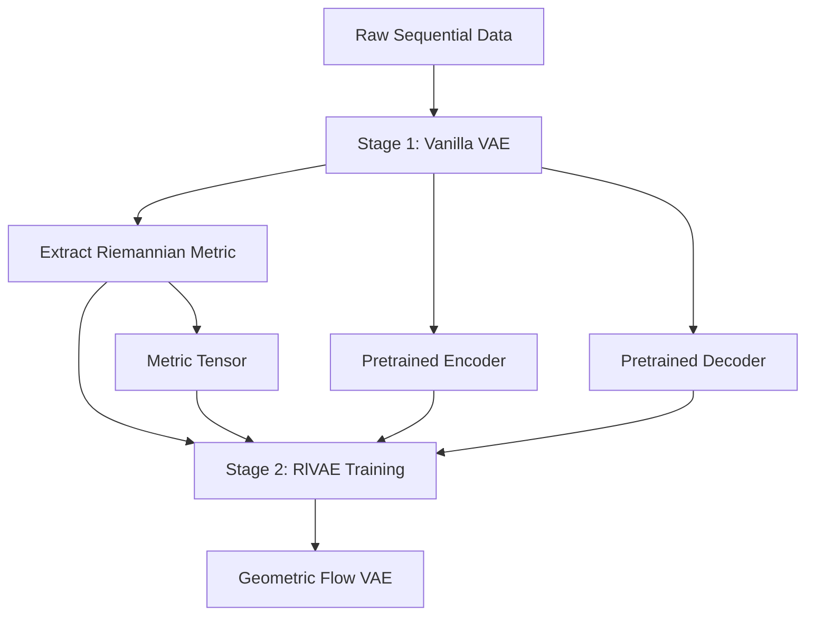

# RlVAE Documentation

Welcome to the comprehensive documentation for the **RlVAE (Riemannian Flow VAE)** research framework. This documentation provides everything needed to understand, use, extend, and contribute to this advanced geometric deep learning system.

## 📋 Documentation Overview

This documentation is organized into **three tiers** based on your experience level and goals:

### 🟢 **Beginner Tier** - Getting Started
- **[Installation Guide](installation.md)** - Complete setup and environment configuration
- **[Training Guide](TRAINING_GUIDE.md)** - Your first experiments and basic workflows
- **[Global Pipeline Guide](GLOBAL_PIPELINE_GUIDE.md)** - Understanding the two-stage architecture

### 🟡 **Intermediate Tier** - Advanced Usage
- **[Hyperparameter Optimization Guide](HYPERPARAMETER_OPTIMIZATION_GUIDE.md)** - Large-scale parameter optimization
- **[Sweep Guide](SWEEP_README.md)** - SLURM cluster computing and parallel optimization
- **[Visualization Guide](MODULAR_VISUALIZATION_GUIDE.md)** - Comprehensive analysis and plotting

### 🔴 **Expert Tier** - Development & Research
- **[Contributing Guide](CONTRIBUTING.md)** - Development setup and contribution guidelines
- **[RlVAE Architecture](GLOBAL_RLVAE_PIPELINE.md)** - Deep dive into system architecture
- **[Cursor Context](.cursor_context.md)** - Complete project context for AI assistants

---

## 🎯 What is RlVAE?

**RlVAE** is a production-ready research framework that combines **Riemannian geometry** with **Variational Autoencoders** to model temporal/sequential data. It addresses fundamental limitations of standard VAEs when dealing with:

- **Temporal Dependencies**: Sequential data where time evolution matters
- **Geometric Structure**: Data that lies on curved manifolds rather than flat Euclidean space
- **Metric Learning**: Discovering optimal distance measures directly from data
- **Flow Dynamics**: Modeling how data evolves along learned geometric structures

### Core Innovation: Two-Stage Pipeline

1. **Stage 1**: Train vanilla VAE and extract geometric structure as Riemannian metric
2. **Stage 2**: Train full RlVAE using extracted components with geometric constraints

---

## 📖 Core Documentation

### 🚀 [Installation Guide](installation.md)
**Complete setup instructions and environment configuration**

**What you'll learn:**
- System requirements and dependency management
- conda/pip environment setup
- GPU configuration and optimization
- Troubleshooting common installation issues
- Verification and testing procedures

**Essential for:** Everyone starting with RlVAE

---

### 🎓 [Training Guide](TRAINING_GUIDE.md) 
**Comprehensive training workflows and best practices**

**What you'll learn:**
- Basic training commands and configuration
- Model architecture selection (MLP, CNN, ResNet)
- Training configuration levels (quick, default, full_data)
- Parameter tuning and optimization strategies
- Monitoring and debugging training runs
- Performance optimization and memory management

**Essential for:** Running your first experiments

**Key Sections:**
- Quick Start Examples
- Configuration System Deep Dive  
- Model Architecture Comparison
- Training Troubleshooting
- Performance Optimization

---

### 🏗️ [Global Pipeline Guide](GLOBAL_PIPELINE_GUIDE.md)
**Two-stage training pipeline architecture and workflow**

**What you'll learn:**
- Stage 1: Vanilla VAE + Metric Extraction workflow
- Stage 2: RlVAE training with loaded components
- Pipeline coordination and data flow
- Component compatibility and versioning
- Best practices for pipeline execution

**Essential for:** Understanding the complete training workflow

**Key Features:**
- Detailed pipeline diagrams
- Component interaction explanations
- Workflow optimization strategies
- Common pipeline issues and solutions

---

## 🔬 Advanced Usage Documentation

### ⚡ [Hyperparameter Optimization Guide](HYPERPARAMETER_OPTIMIZATION_GUIDE.md)
**Large-scale parameter optimization with WandB and SLURM**

**What you'll learn:**
- WandB sweep configuration and management
- Three-tier optimization strategy:
  1. **Architecture Optimization**: Finding best model architectures
  2. **Training Optimization**: Optimizing learning dynamics  
  3. **Comprehensive Optimization**: Full parameter space search
- Early termination strategies (Hyperband)
- Multi-agent parallel optimization
- Results analysis and selection

**Essential for:** Systematic model optimization

**Available Sweeps:**
- `learning_rate_optimization` - 50 runs, training dynamics
- `architecture_optimization` - Grid search, architecture comparison
- `comprehensive_hyperparameter_sweep` - 100 runs, full parameter space

---

### 🖥️ [Sweep Guide](SWEEP_README.md)
**SLURM cluster computing and large-scale hyperparameter sweeps**

**What you'll learn:**
- SLURM batch script configuration and usage
- Resource management and time limits
- Parallel sweep agent coordination
- Extended sweep strategies for unlimited duration
- Monitoring and debugging cluster jobs
- Resource optimization and scaling

**Essential for:** Large-scale optimization on clusters

**SLURM Scripts:**
- `run_hyperparameter_sweep.sbatch` - Standard 47-hour sweeps
- `run_hyperparameter_sweep_short.sbatch` - 4-hour test sweeps
- `run_extended_sweep.sh` - Unlimited duration via chunking

---

### 📊 [Visualization Guide](MODULAR_VISUALIZATION_GUIDE.md)
**Comprehensive analysis and visualization system**

**What you'll learn:**
- Modular visualization architecture
- Five visualization levels: minimal → full
- Interactive plotting and analysis tools
- WandB integration and logging
- Performance optimization for large datasets
- Custom visualization development

**Essential for:** Deep analysis and publication-quality figures

**Visualization Modules:**
- **Basic**: Training curves, reconstructions, loss plots
- **Manifold**: Latent space analysis, geodesics, curvature
- **Interactive**: Interactive plots, animations, hover details
- **Flow Analysis**: Normalizing flow diagnostics
- **Dynamics**: Temporal evolution analysis

---

## 🛠️ Development & Research Documentation

### 🤝 [Contributing Guide](CONTRIBUTING.md)
**Development setup, coding standards, and contribution guidelines**

**What you'll learn:**
- Development environment setup and requirements
- Code style standards and formatting guidelines
- Testing procedures and quality assurance
- Pull request process and review criteria
- Research contribution guidelines
- Documentation standards

**Essential for:** Contributors and developers

---

### 🏛️ [RlVAE Architecture](GLOBAL_RLVAE_PIPELINE.md)
**Deep dive into system architecture and design principles**

**What you'll learn:**
- Core architectural patterns and design decisions
- Modular component system design
- Configuration management philosophy
- Extensibility and plugin architecture
- Performance considerations and optimizations
- Research design principles

**Essential for:** Understanding system internals

---

## 🗂️ Quick Reference Tables

### 📋 Documentation Quick Reference
| Need | Document | Time to Read | Prerequisites |
|------|----------|-------------|---------------|
| **Get Started** | [Installation Guide](installation.md) | 15 min | None |
| **First Experiment** | [Training Guide](TRAINING_GUIDE.md) | 30 min | Installation complete |
| **Understand Pipeline** | [Pipeline Guide](GLOBAL_PIPELINE_GUIDE.md) | 20 min | Basic training knowledge |
| **Optimize Models** | [Hyperparameter Guide](HYPERPARAMETER_OPTIMIZATION_GUIDE.md) | 45 min | Pipeline understanding |
| **Scale to Clusters** | [Sweep Guide](SWEEP_README.md) | 30 min | Hyperparameter experience |
| **Create Visualizations** | [Visualization Guide](MODULAR_VISUALIZATION_GUIDE.md) | 40 min | Training experience |
| **Contribute Code** | [Contributing Guide](CONTRIBUTING.md) | 20 min | Development experience |
| **Understand Architecture** | [Architecture Guide](GLOBAL_RLVAE_PIPELINE.md) | 60 min | System familiarity |

### 🔧 Configuration Quick Reference
| Configuration Type | Examples | Use Case |
|-------------------|----------|----------|
| **Models** | `vanilla_vae`, `mlp_rlvae`, `cnn_rlvae`, `resnet_rlvae` | Architecture selection |
| **Training** | `quick`, `default`, `full_data` | Training duration/data |
| **Experiments** | `single_run`, `comparison_study`, `global_vanilla_rlvae_pipeline` | Experiment type |
| **Sweeps** | `learning_rate_optimization`, `architecture_optimization`, `comprehensive_hyperparameter_sweep` | Optimization strategy |
| **Visualization** | `minimal`, `standard`, `full`, `final_only`, `end_only` | Analysis depth |

### 🏗️ Architecture Quick Reference
| Component | Location | Purpose |
|-----------|----------|---------|
| **ModularVanillaVAE** | `src/models/modular_vanilla_vae.py` | Stage 1: Metric extraction |
| **ModularRlVAE** | `src/models/modular_rlvae.py` | Stage 2: Full RlVAE (100% modular) |
| **HybridRlVAE** | `src/models/hybrid_rlvae.py` | Performance-optimized (2x faster) |
| **EncoderManager** | `src/models/components/encoder_manager.py` | Plug-and-play encoders |
| **MetricTensor** | `src/models/components/metric_tensor.py` | Optimized Riemannian metrics |
| **FlowManager** | `src/models/components/flow_manager.py` | Normalizing flow management |

---

## 🚀 Recommended Learning Paths

### 🎯 **Path 1: Research User**
*Goal: Run experiments and analyze results*

1. **Start**: [Installation Guide](installation.md) → [Training Guide](TRAINING_GUIDE.md)
2. **Understand**: [Pipeline Guide](GLOBAL_PIPELINE_GUIDE.md)
3. **Optimize**: [Hyperparameter Guide](HYPERPARAMETER_OPTIMIZATION_GUIDE.md)
4. **Analyze**: [Visualization Guide](MODULAR_VISUALIZATION_GUIDE.md)
5. **Scale**: [Sweep Guide](SWEEP_README.md)

**Timeline**: 1-2 weeks for proficiency

---

### 🔬 **Path 2: Method Developer**
*Goal: Extend the framework and develop new methods*

1. **Foundation**: [Installation](installation.md) → [Training](TRAINING_GUIDE.md) → [Pipeline](GLOBAL_PIPELINE_GUIDE.md)
2. **Deep Dive**: [Architecture Guide](GLOBAL_RLVAE_PIPELINE.md)
3. **Development**: [Contributing Guide](CONTRIBUTING.md)
4. **Context**: [Cursor Context](.cursor_context.md)
5. **Advanced**: [Visualization Guide](MODULAR_VISUALIZATION_GUIDE.md) + [Sweep Guide](SWEEP_README.md)

**Timeline**: 2-3 weeks for development readiness

---

### ⚡ **Path 3: Production User**
*Goal: Deploy at scale and optimize performance*

1. **Basics**: [Installation](installation.md) → [Training Guide](TRAINING_GUIDE.md)
2. **Scale**: [Sweep Guide](SWEEP_README.md) → [Hyperparameter Guide](HYPERPARAMETER_OPTIMIZATION_GUIDE.md)
3. **Optimize**: [Architecture Guide](GLOBAL_RLVAE_PIPELINE.md) (performance sections)
4. **Monitor**: [Visualization Guide](MODULAR_VISUALIZATION_GUIDE.md) (monitoring sections)

**Timeline**: 1 week for deployment readiness

---

## 💡 Tips for Getting Started

### 🟢 **If you're new to the framework:**
1. Start with [Installation Guide](installation.md) - don't skip the verification steps
2. Run the quick examples in [Training Guide](TRAINING_GUIDE.md) 
3. Read [Pipeline Guide](GLOBAL_PIPELINE_GUIDE.md) to understand the two-stage approach
4. Experiment with different configurations before diving into optimization

### 🟡 **If you have some experience:**
1. Jump to [Hyperparameter Guide](HYPERPARAMETER_OPTIMIZATION_GUIDE.md) for systematic optimization
2. Use [Sweep Guide](SWEEP_README.md) for cluster computing
3. Explore [Visualization Guide](MODULAR_VISUALIZATION_GUIDE.md) for advanced analysis

### 🔴 **If you're an expert user:**
1. Review [Architecture Guide](GLOBAL_RLVAE_PIPELINE.md) for system internals
2. Check [Contributing Guide](CONTRIBUTING.md) for development setup
3. Use [Cursor Context](.cursor_context.md) for comprehensive project understanding

---

## 🔍 Finding Information

### 📖 **By Topic**
- **Setup & Installation** → [Installation Guide](installation.md)
- **Model Training** → [Training Guide](TRAINING_GUIDE.md)
- **Architecture Understanding** → [Pipeline Guide](GLOBAL_PIPELINE_GUIDE.md)
- **Parameter Optimization** → [Hyperparameter Guide](HYPERPARAMETER_OPTIMIZATION_GUIDE.md)
- **Cluster Computing** → [Sweep Guide](SWEEP_README.md)
- **Data Analysis** → [Visualization Guide](MODULAR_VISUALIZATION_GUIDE.md)
- **Code Development** → [Contributing Guide](CONTRIBUTING.md)
- **System Architecture** → [Architecture Guide](GLOBAL_RLVAE_PIPELINE.md)

### 🎯 **By Use Case**
- **"I want to run my first experiment"** → [Training Guide](TRAINING_GUIDE.md)
- **"I want to optimize hyperparameters"** → [Hyperparameter Guide](HYPERPARAMETER_OPTIMIZATION_GUIDE.md)
- **"I want to use SLURM clusters"** → [Sweep Guide](SWEEP_README.md)
- **"I want to create visualizations"** → [Visualization Guide](MODULAR_VISUALIZATION_GUIDE.md)
- **"I want to contribute code"** → [Contributing Guide](CONTRIBUTING.md)
- **"I want to understand the architecture"** → [Architecture Guide](GLOBAL_RLVAE_PIPELINE.md)

### 🚨 **By Problem**
- **Installation issues** → [Installation Guide](installation.md) (Troubleshooting section)
- **Training not working** → [Training Guide](TRAINING_GUIDE.md) (Debugging section)
- **Sweep failing** → [Sweep Guide](SWEEP_README.md) (Common issues)
- **Poor performance** → [Architecture Guide](GLOBAL_RLVAE_PIPELINE.md) (Performance section)
- **Configuration errors** → [Training Guide](TRAINING_GUIDE.md) (Configuration section)

---

## 📞 Getting Help

### 📚 **Documentation Issues**
If you find unclear, outdated, or missing documentation:
1. Check if the information exists in another guide
2. Open an issue describing what's unclear
3. Suggest improvements or submit a PR

### 🐛 **Technical Issues**
For technical problems:
1. Check the relevant troubleshooting sections
2. Search existing issues on GitHub
3. Provide minimal reproduction examples when reporting

### 💡 **Feature Requests**
For new features or improvements:
1. Review [Contributing Guide](CONTRIBUTING.md)
2. Discuss in issues before implementing
3. Follow the development guidelines

---

**🔗 Need more context?** See [`.cursor_context.md`](../.cursor_context.md) for comprehensive project context, especially useful for AI assistants and new contributors.

**🚀 Ready to start?** Begin with the [Installation Guide](installation.md) and work your way through the documentation based on your goals! 